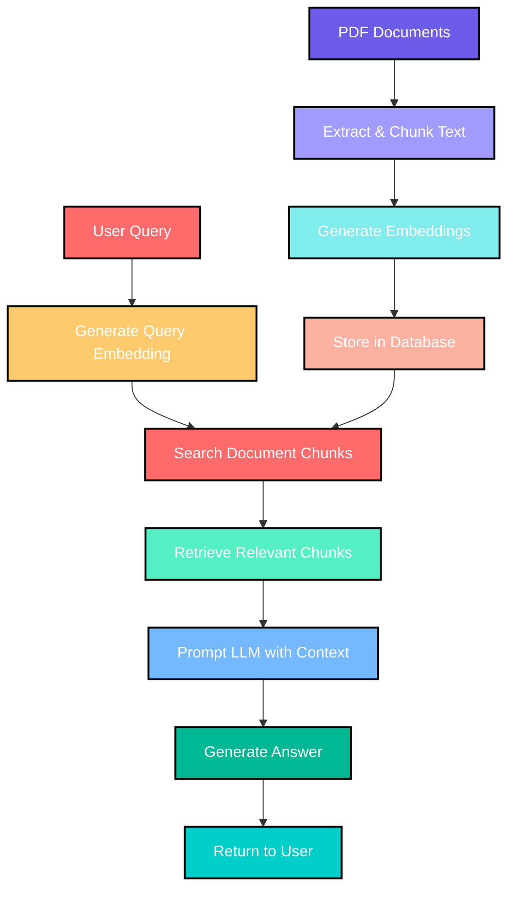

# Basic Implementation of RAG using Gemini, FastAPI, PostgreSQL and Flutter

[](https://fastapi.tiangolo.com/)
[](https://flutter.dev/)
[](https://ai.google.dev/)
[](https://www.postgresql.org/)
[](LICENSE)

A cross-platform application that uses RAG (Retrieval Augmented Generation) to query PDF documents with natural language. Built with Flutter, FastAPI, and Google's Gemini AI.


## What is RAG?

RAG (Retrieval Augmented Generation) combines the power of large language models with specific document retrieval. Instead of relying solely on the model's training data, RAG first searches through your documents to find relevant information, then uses that context to generate accurate, precise answers.




## Features

- **PDF Upload**: Upload and process PDF documents
- **Natural Language Queries**: Ask questions about your documents in plain English
- **Cited Answers**: Get accurate answers with citations to the source material
- **Document Management**: View and organize your uploaded PDFs
- **Cross-Platform**: Works on desktop and mobile devices

## Tech Stack

- **Frontend**: Flutter with Material Design 3
- **Backend**: FastAPI (Python)
- **Database**: PostgreSQL for storing document embeddings
- **AI**: Google Gemini 1.5 Flash for question answering
- **Embeddings**: Sentence-Transformers for semantic search


## App Screenshots

### Backend End-points (Swagger)


### Labor Law Act - QA Interaction
I uploaded the labor-law-act-2048 and asked the questions from the paper.

<div align="center">
  
  
  
  
</div>

### CV-Based QA Interaction
I uploaded my CV and asked some questions from it.

<div align="center">
  
  
</div>


## Getting Started

### Prerequisites

- Python 3.9+
- Flutter SDK
- PostgreSQL database
- Google Gemini API key

### Backend Setup

1. Clone the repository and navigate to the backend folder:

   ```bash
   cd backend
   ```

2. Create a virtual environment and install dependencies:

   ```bash
   python -m venv venv
   source venv/bin/activate  # On Windows: venv\Scripts\activate
   pip install -r requirements.txt
   ```

3. Set up environment variables:

   ```bash
   # Create a .env file with the following variables
   GOOGLE_API_KEY=your_gemini_api_key
   PDF_STORAGE_DIR=pdf_storage
   POSTGRES_DB=rag_pdf_db
   POSTGRES_USER=postgres
   DB_PASSWORD=your_password
   POSTGRES_HOST=localhost
   POSTGRES_PORT=5432
   BASE_URL=http://localhost:8000
   ```

4. Create the database table:

   ```sql
   CREATE TABLE pdf_embeddings (
       id SERIAL PRIMARY KEY,
       chunk_text TEXT NOT NULL,
       embedding JSONB NOT NULL,
       source TEXT NOT NULL
   );
   ```

5. Run the backend server:
   ```bash
   uvicorn app:app --reload
   ```

### Frontend Setup

1. Navigate to the frontend folder:

   ```bash
   cd frontend
   ```

2. Install dependencies:

   ```bash
   flutter pub get
   ```

3. Run the app:
   ```bash
   flutter run
   ```

## How to Use

1. **Upload PDF**: Click the "Upload PDF" button to select and upload a PDF document
2. **Ask Questions**: Type your question in the text field and click "Search Documents"
3. **View Results**: The app will display answers based on the content of your PDFs
4. **Check Sources**: Click on the source links to open the original PDF document

## How It Works

1. **PDF Processing**: PDFs are uploaded, text is extracted and split into chunks
2. **Embedding Generation**: Text chunks are converted into numerical vectors (embeddings)
3. **Query Processing**: User questions are converted to embeddings and compared to document chunks
4. **Answer Generation**: Relevant chunks are sent to Gemini AI with the question to generate an answer
5. **Citation**: The answer is returned with links to the source documents

## Project Structure

```
RAG_Using_Gemini_FastAPI_Flutter
├── backend/
│ ├── config/
│ │ └── settings.py # Environment variable loading and configuration
│ ├── database/
│ │ └── db.py # Database connection and operations
│ ├── services/
│ │ ├── pdf_service.py # PDF processing logic
│ │ └── embedding_service.py # Embedding generation
│ ├── api/
│ │ └── endpoints.py # FastAPI endpoint definitions
│ ├── app.py # Main FastAPI application entry point
│ └── requirements.txt # Python dependencies
│
├── frontend/
│ ├── lib/
│ │ ├── main.dart # Flutter app entry point
│ │ ├── screens/
│ │ │ └── home_page.dart # Home page UI
│ │ └── services/
│ │ └── api_service.dart # Handles API calls
│ │ └── file_service.dart # Handles file operations
```


## Acknowledgements

- [Google Gemini](https://ai.google.dev/) for the AI model
- [Sentence-Transformers](https://www.sbert.net/) for embedding generation
- [FastAPI](https://fastapi.tiangolo.com/) for the backend framework
- [Flutter](https://flutter.dev/) for the frontend framework
